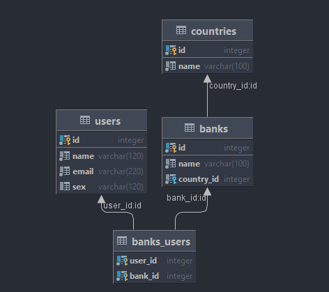

## Схема таблиц в Базе данных:

## Запросы

### Описание запросов для таблицы users:

- GET - получение данных о пользователе по id.

  Пример: http://localhost:8080/CustomRestService_war/users/1 - получение данных о пользователе с id 1.

- POST - создание пользователя 
  
  Пример: http://localhost:8080/CustomRestService_war/users/ - создание пользователя
  
  Пример передаваемых данных:
  ```
  {
  "name": "username",
  "email": "username@mail.ru",
  "sex": "male"
  }
  ```
- PUT - изменение данных о пользователе

  Пример: http://localhost:8080/CustomRestService_war/users/1 - изменение данных о пользователе с id 1.

  Пример передаваемых данных:
  ```
  {
  "id": 1,
  "name": "username",
  "email": "username@mail.ru",
  "sex": "male"
  }
  ```
- GET - Удаление пользователя по id.
  Пример: http://localhost:8080/CustomRestService_war/users/1 - удаления пользователя с id 1.


###Описание запросов для таблицы banks:

- GET - получение данных о банке по id.
  Пример: http://localhost:8080/CustomRestService_war/banks/1 - получение данных о банке с id 1.
- POST - создание банка

  Пример: http://localhost:8080/CustomRestService_war/banks/ - создание банка

  Пример передаваемых данных:
  ```
  {
  "name": "bank name",
  "country_id": 1
  }
  ```
- PUT - изменение данных о банке

  Пример: http://localhost:8080/CustomRestService_war/banks/1 - изменение данных о банке с id 1.

  Пример передаваемых данных:
  ```
  {
    "id": 1,
    "name": "bank name 2",
    "country_id": 2
  }
  ```
- GET - Удаление банка по id.
  Пример: http://localhost:8080/CustomRestService_war/banks/1 - удаления банка с id 1.


###Описание запросов для таблицы countries:

- GET - получение данных об стране по id.

  Пример: http://localhost:8080/CustomRestService_war/countries/1 - получение данных об стране с id 1.

- POST - создание страны

  Пример: http://localhost:8080/CustomRestService_war/countries/ - создание страны

  Пример передаваемых данных:
  ```
  {
  "name": "Russia"
  }
  ```
- PUT - изменение данных об стране

  Пример: http://localhost:8080/CustomRestService_war/countries/1 - изменение данных об стране с id 1.

  Пример передаваемых данных:
  ```
  {
  "id": 1,
  "name": "USA"
  }
  ```
- GET - Удаление страны по id.

  Пример: http://localhost:8080/CustomRestService_war/countries/1 - удаления страны с id 1.


###Описание запросов:

- GET - НЕДОСТУПНО.

- POST - добавление банка пользователю с заданным id

  Пример: http://localhost:8080/CustomRestService_war/usersbanks/ - Добавление банка с id 1, 2, 3 пользователю с id 1

  Пример передаваемых данных:
  ```
  {
  "user_id": 1,
  "banks_id": [1,2,3]
  }
  ```
- PUT - НЕДОСТУПНО.

- DELETE - удаление банка у пользователя с заданным id

  Пример: http://localhost:8080/CustomRestService_war/usersbanks/ - удаления банка с id 1, 2, 3 у пользователя с id 1.
  ```
  {
  "user_id": 1,
  "banks_id": [1,2,3]
  }
  ```
